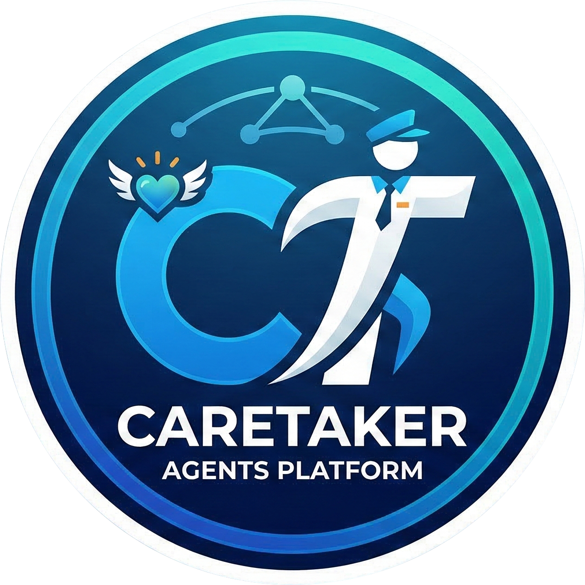

<p align="center">
  
</p>

<p align="center">
  <a href="https://www.npmjs.com/package/@hyperwindmill/caretaker-cli"></a>
  <a href="LICENSE"></a>
</p>

# caretaker

Yet another agent harness. Yes — but built the way I want one to be.

A terminal-native home for your agents that you can also drive from a local web app, an Electron desktop app, or a VSCode sidebar. You create _named agents_, each with its own identity, its own tools, its own working directory, and its own conversations. You bring your keys. They do the work. All on-disk state lives under `~/.caretaker/`.

## Surfaces

The harness, agents store, plugins, MCP servers, skills, slash commands and confirm gate are shared by every entry point. **The web server is the functional superset** — some features only ship there, and both the desktop app and the web GUI run on top of it.

- **Web server (`caretaker-cli web`)** — `pnpm -F @hyperwindmill/caretaker-cli dev web` (or `caretaker-cli web --port 3000`) starts a local Hono + WebSocket server that serves the webview as a desktop-grade two-column web app. It is the only surface that boots the **scheduler** (see below), and it hosts the **Scheduler** settings tab and the **Execution Console**.
- **Desktop (`caretaker-desktop`)** — an Electron shell in [`packages/desktop`](packages/desktop). It is **not** a separate GUI: the main process picks a free port, forks the CLI's own web server (`caretaker-cli web`) as a child process, and frames `http://127.0.0.1:<port>` in a `BrowserWindow` with a system tray and single-instance lock. Because it runs the full web server, **the scheduler runs under the desktop app too**. Build/run with `pnpm desktop:dev`, package installers with `pnpm desktop:dist` (electron-builder targets Windows/macOS/Linux).
- **TUI** — `pnpm -F @hyperwindmill/caretaker-cli dev` launches the Ink terminal app. Manage providers, agents, plugins, MCP servers, and chat. It does **not** run the scheduler and does not expose the scheduler UI.
- **VSCode sidebar** — [`packages/vscode-extension`](packages/vscode-extension) embeds the harness as an ESM library (no subprocess). Same `~/.caretaker/` state, same agents, same conversations. Full Providers / Agents / Plugins / MCP configuration is available from the sidebar Settings panel; only the scheduler is missing because the daemon is not booted here.
- **Headless** — `caretaker-cli run [prompt...] --agent <name>` does one-shot dispatches for scripts and CI; `--output json` for a structured blob.

> **Scheduler availability in one line:** scheduled work fires whenever a web-server process is up — that means `caretaker-cli web` **or** the desktop app, but never the bare TUI or the VSCode sidebar.

## What makes it caretaker

### Quick setup

`pnpm install`, `pnpm -F @hyperwindmill/caretaker-cli dev`, and the first-run wizard walks you through adding a provider and creating your first agent. No accounts, no daemons, no signup.

State lives under `~/.caretaker/`: JSON for config, JSONL for chat sessions and scheduler logs, plus a [`@morphql/store`](https://www.npmjs.com/package/@morphql/store) folder database under `~/.caretaker/store/` that backs the task/project system (see below). It's all readable, inspectable, deletable. Override the root with `CARETAKER_HOME=/path/to/dir` and you have an isolated environment in one env var. Writes go through a tmp-file + atomic rename, with a Windows-safe retry on `EACCES`/`EPERM`/`EBUSY` so Defender or OneDrive locking the file doesn't corrupt your config.

### BYOK — bring your own keys

Any OpenAI-compatible provider works: hosted endpoints, internal gateways, local model servers. Add a base URL and an API key; the UI auto-fetches the model list from `/v1/models` so you pick from real options instead of typing model strings. The provider client streams chat completions over SSE — no provider-specific SDK.

Secrets at rest are AES-256-GCM encrypted: plugin-source auth tokens, MCP server credentials, scheduler Telegram bot tokens. The encryption key is persisted with mode 0600.

### Claude Code as a provider

Instead of an OpenAI-compatible endpoint, a provider can be `type: 'claude-code'`: agents on it run through your local [Claude Code](https://claude.com/product/claude-code) CLI instead of an HTTP API. Requirements: Claude Code installed and already authenticated (`claude` on your `PATH`, or point `command` at the binary) — caretaker never handles Claude Code credentials itself, it just spawns `claude -p` and streams the result back into the chat, exactly like any other agent.

Claude Code agents use Claude Code's own tools and its own permission modes instead of caretaker's tool picker and confirm gate — set a permission mode per agent, or let it fall back to whatever `~/.claude/settings.json` already has configured. Chat sessions resume the same underlying Claude Code session turn over turn, so context and history stay continuous. Scheduler and autonomous-task runs are unattended, so they always run with permissions bypassed; the autonomous task tools (`task_create`, `task_complete`, etc.) reach a claude-code agent through a small local HTTP bridge that **only the web server starts** — so autonomous tasks and the cron/Telegram scheduler need `caretaker-cli web` (or the desktop app) running, same as any other scheduled work.

> Uses your local Claude Code session; Anthropic may bill programmatic use as extra usage.

Windows users whose Claude Code was installed via npm should set the provider `command` to the full path of `claude.exe` — npm's `.cmd` shim cannot be spawned directly.

_Claude and Claude Code are trademarks of Anthropic, PBC. This project is an independent open-source tool and is not affiliated with, endorsed, or sponsored by Anthropic._

### Agent identities, not "an agent"

Caretaker is built around having _several_ agents that mean different things to you — a code agent rooted in one repo with a focused toolset, a writing agent in your notes folder with no shell, a research agent with read-only tools and web fetch.

Each agent has its own model, system prompt, working directory, allowed tools, plugins, MCP servers, and persistent chat history. You switch between them; they don't bleed into each other.

### Closed by default

A new agent has _zero_ tools. You opt in, one by one, in a tri-state picker: `[ ]` off, `[x]` allowed, `[!]` allowed-but-confirm-each-call.

The runtime confirm gate prompts before every call to a `[!]` tool: _Run once_, _Always (this session)_, or _Reject_. "Always" is per-session — a restart restores caution. A gate that throws is treated as reject. Esc rejects the single call without aborting the run.

There is no implicit shell, no implicit filesystem write, no surprise capability. The one exception is `get_agent_context` (pure read-only introspection of token usage), which is always available because there is no reason to hide it.

### Caretaker agents have a prelude

What makes an agent a _caretaker_ agent and not a generic chat completion is a small, always-prepended system prompt. It tells the model it is a caretaker, and that being one means three things: **care about the goal** (the task is successful only when the user is satisfied), **care about the environment** (check that actions are never harmful), and **care about the project** (every change should leave it better — when the requested path won't, push back and propose a better one).

The prelude is followed by your agent's own system prompt, then the active plugin/skill blocks, then project context: `AGENTS.md` and the most commonly used alternatives, walked up from the agent's working directory, plus equivalent files in your home for cross-project rules, and finally a `<runtime-info>` block. Everything is capped at 100 KB/file and 250 KB total, with `@<file>` refs resolved single-pass. The order is stable across every turn, so the model's sense of where it is doesn't drift.

### A soft filesystem jail

Tools that touch files refuse paths outside the agent's working directory and don't follow symlinks out of it. `write` enforces read-before-write. `edit` and `multiedit` rely on exact `oldString` match as an implicit invariant.

None of this is a security boundary against an adversary; all of it stops the boring accidents that happen ten times a day. See [SECURITY.md](SECURITY.md) for the honest security model.

### Plugins, MCP, skills, slash commands

Agents can pull in plugins from git repositories or local paths. Sources are managed from the TUI/web GUI (add, refresh, remove); each agent then opts in to the plugins it wants. Three manifest kinds are discovered: `cc-marketplace` (`.claude-plugin/marketplace.json`), `cc-plugin` (`.claude-plugin/plugin.json`), and a skill-glob fallback (every `**/SKILL.md`). A single plugin record can ship:

- **skills** — markdown blocks injected into the system prompt when the agent opts in, plus the `list_skills` / `read_skill` builtins so the model can pull a skill in on demand.
- **slash commands** — `/foo args` parsed from the chat input. Per-agent gating via `agent.plugins`; arguments expand via `$1..$9` / `$ARGUMENTS`. Mirrored on the agent side as `list_commands` / `invoke_command`.
- **managed agents** — extra agent rows that show up alongside the ones you created by hand.
- **MCP servers** — both stdio and HTTP/SSE clients are pooled and tracked; tools, prompts and resources are surfaced through the same registry as native builtins.

Refresh failures preserve the previous good state, so an outage doesn't strip plugins mid-session. Managed agents and managed MCP servers follow a cascading-delete model tied to their source plugin.

### Sub-agent dispatch

When you opt the agent into `list_agents` and `invoke_agent` (same tri-state as every other tool), the agent can dispatch work in two modes:

- **Named** — `invoke_agent({name, task})` dispatches a configured agent. The child inherits provider/model/tools/plugins/mcpServers/workingDir from the caller when its own fields are empty, but **never** `systemPrompt` or `maxTurns`. Self-invocation is rejected.
- **Anonymous** — `invoke_agent({task})` (no `name`) spins up an ephemeral generic agent that inherits everything from the caller and has no `systemPrompt` of its own; the task IS the prompt. Useful for delegating speculative subtasks without polluting the parent's history or dragging the parent's identity along. Works even when only one agent is configured.

Recursion is capped at depth 5. The confirm gate is plumbed all the way through, so the user still gates child tool calls.

### Autonomous task/project system

Beyond one-shot chats, caretaker ships a task/project system backed by the `@morphql/store` folder database under `~/.caretaker/store/`. It models **Projects**, **Tasks** (draft / planning / active / reviewing / paused / blocked / done, with checklist items and no-progress guards; tasks can also be archived or permanently deleted), and **TaskMessages**. A family of built-in `mcp__task__*` tools (`task_create`, `task_get_state`, `task_update_checklist_item`, `task_add_message`, `task_complete`, `task_block`, `task_unblock`, `task_yield`, `task_activate`, `task_unpause`, `task_search`, `project_list`, `task_discard_worktree`, `task_archive`, `task_unarchive`, `task_delete`, `task_set_agent`, `task_submit_plan`) lets agents advance long-running objectives one step per invocation. A dedicated scheduler tick drives active tasks autonomously with per-invocation time and turn budgets. Archived tasks are hidden from the default list and excluded from the scheduler; the web GUI has a "Show archived" toggle and a delete action (confirm-gated) that permanently removes a task and its messages.

Each task can run with **three distinct agent roles**, configurable per project and per task: a **planner**, a **developer** (the classic task agent), and a **reviewer**. Unset roles simply fall back to the developer, so a single-agent setup behaves exactly as before. New tasks start in a **planning phase** (on by default, toggleable per project/task): the planner explores the workspace **read-only** — write/edit/bash tools are stripped — and must submit an explicit implementation plan with `task_submit_plan` before execution begins; the plan lands in the task thread and is replayed to the developer on every cycle. An opt-in **SDD mode** (per project or per task, off by default) lets the planner write markdown documents — specs, plans, ADRs — during planning, following the project's own documentation conventions; everything else stays read-only and the docs land on the task branch together with the plan.

When a task's project lives in a git repo, the harness gives it a **dedicated worktree on its own branch** (`caretaker/task-<id>-<slug>`): the autonomous agent works in isolation instead of your live tree, each cycle's progress is committed as a WIP commit, and when the task is done the worktree is removed while the branch stays behind for you to review or merge — nothing autonomous ever lands on `main`. Before a task is finalized, it goes through a **review gate** (on by default, toggleable per project/task): instead of finalizing, the task enters a `reviewing` state (shown as active in the UI) and an independent review pass — run by the reviewer-role agent — inspects the branch on the next tick; if it requests changes, the task reopens so the agent addresses the feedback next cycle (capped at three rounds); only a passing review removes the worktree and marks it done. Projects that aren't git repos simply run in place and finalize directly, unchanged. If a `dockerImage` is configured for the project, **all** of its tasks' heartbeat cycles — development, planning, and the review pass — run inside a dedicated Docker container (`caretaker-task-<projectId>-<taskId>`) that bind-mounts the task worktree (and the git metadata) at identical paths and executes as the host user, so shell work and dependencies stay isolated in a reproducible environment. Native `bash` commands run via `docker exec`; `claude-code` agents run on the host but route their shell commands into the container via an automatic settings hook, with file access confined to the working dir. In-container `git` is best-effort — if your image doesn't ship it, add it via a bootstrap command (e.g. `apt-get install -y git`); commits happen host-side regardless. Docker must be installed on the machine running the web server/scheduler.

`dockerImage` accepts either a **pullable image ref** (`node:24`, `ghcr.io/org/img:tag`) or a **path to a Dockerfile** — any value starting with `.`, `/`, or `\` is treated as a Dockerfile path (resolved against the project dir, built with its own directory as context) and built into a per-project image (`caretaker-project-<id>:latest`), rebuilt (cached) when a container is next created. This is the easiest way to get a project-tailored environment (right runtime + package manager + system libs) without maintaining a separate registry image.

Because the container runs as **your host user** (not root — so files it writes stay yours), a global install like `npm install -g pnpm` fails with `EACCES` (the global dir is root-owned). Put your **package manager in the image** (via a Dockerfile path as above, e.g. `FROM node:24` + `RUN corepack enable pnpm`) and use `bootstrapCommands` only for **dependencies** (`pnpm install`). Installing a package manager at runtime as a non-root user (`npm i -g …`) won't work, and one-shot workarounds like `npx pnpm install` don't leave `pnpm` on `PATH` for later cycles.

### Scheduler

The web server boots an in-process background scheduler that ticks every 15 s. It runs **three** loops:

- **Cron heartbeat** — a standard 5-field cron expression (`* * * * *`, lists, ranges, step patterns) fires a one-shot run of the agent with a fixed prompt. Tool calls auto-approve (it's unattended).
- **Telegram poller** — polls Telegram `getUpdates` and routes incoming messages to the agent as an interactive conversation. The bot token is encrypted at rest; the offset is committed atomically before processing to prevent duplicate runs; messages from the same chat are serialised so a rapid second message never gets dropped. The **Allowed Chat IDs** whitelist is the only access boundary — without it, anyone who knows the token can execute every tool the agent has enabled, which the UI calls out explicitly.
- **Autonomous task heartbeat** — advances the task/project system described above, independent of any configured scheduled task. Each cycle runs the agent for the task's current phase (planner / developer / reviewer); git-backed tasks run in a dedicated worktree/branch, commit progress each cycle, and pass through a review gate (when enabled) before the worktree is cleaned up at DONE.

Each task gets its own JSONL execution log under `~/.caretaker/scheduler-logs/`; the web GUI's Execution Console shows past runs with full message rendering. Remember: the scheduler only runs where the web server runs (`caretaker-cli web` or the desktop app), never under the bare TUI or VSCode.

## Install

```bash
npm install -g @hyperwindmill/caretaker-cli
# or: pnpm add -g @hyperwindmill/caretaker-cli
```

Then run it:

```bash
caretaker-cli                          # launch the TUI
caretaker-cli web                      # local web GUI (http://127.0.0.1:3000)
caretaker-cli run "…" --agent <name>   # headless one-shot dispatch
```

Requires Node ≥ 20. Electron desktop and VSCode sidebar builds are attached to each [GitHub Release](https://github.com/Hyperwindmill/caretaker-cli/releases).

On first run: pick **Providers → New**, paste your base URL and key, save. Then **Agents → New**, choose a model, name the agent, set a working directory, pick your tools, write a system prompt, and start chatting.

## From source (development)

```bash
pnpm install
pnpm -F @hyperwindmill/caretaker-cli dev                          # launch the TUI
pnpm -F @hyperwindmill/caretaker-cli dev web                      # local web GUI (http://127.0.0.1:3000)
pnpm desktop:dev                                                 # Electron desktop app
CARETAKER_HOME=/tmp/ct pnpm -F @hyperwindmill/caretaker-cli dev   # isolated dev environment
```

```bash
pnpm build                                        # build every workspace package
pnpm test                                         # run every package's tests
pnpm -F @hyperwindmill/caretaker-cli test         # node test runner for the cli alone
pnpm -F @hyperwindmill/caretaker-cli typecheck    # tsc --noEmit
```

Package manager: **pnpm** (≥10). The repo is a pnpm workspaces monorepo; `npm install` / `package-lock.json` are not supported.

## Built-in tools

Filesystem (sandboxed to the agent's working directory): `read_file`, `write`, `edit`, `multiedit`, `glob`, `grep`. Rich readers: `read_document` (PDF / Word / Excel), `read_image`, `read_attachment`.

Network: `fetch`. Shell: `bash`.

Always-on (not configurable from the picker because it's pure introspection):

- `get_agent_context` — live token usage and context-window percentage. Read-only, no side effects.

Auto-injected by the resolver when their preconditions hold (so a fresh agent's opt-in surface isn't polluted by them):

- `list_skills`, `read_skill` — when the agent has at least one active plugin.
- `list_commands`, `invoke_command` — same gating as skills.
- MCP tools (`mcp__<id>__<tool>`) — resolved per-run from the agent's configured servers, including the `mcp__task__*` task tools.

Standard opt-in (tri-state in the agent's tool picker, like every other tool):

- `list_agents`, `invoke_agent` — sub-agent dispatch. `[x]` allowed or `[!]` confirm. `invoke_agent` is dual-mode (named + anonymous) — see _Sub-agent dispatch_.

## Layout

pnpm workspaces monorepo, five packages:

```
packages/cli/                the Caretaker CLI/TUI, headless `run`, and the Hono web server.
  src/
  ├── index.ts               entry: TUI render + boot-time plugin refresh + MCP shutdown
  ├── types.ts               (re-exports caretaker-types)
  ├── cli/                   subcommand router (commander): TUI default, `run`, `web`
  │   ├── run.ts               one-shot headless dispatch
  │   └── web/                 local Hono server + WebSocket bridge to the webview
  │       ├── server.ts            HTTP/WS routes, harness invocation, scheduler boot
  │       ├── scheduler.ts         tick loop, daemon lifecycle, public re-exports
  │       └── scheduler/           strategy pattern: heartbeat, telegram, task, task_review, locks, logs
  ├── store/                 atomic JSON writes + @morphql/store task/project DB
  ├── lib/                   AES-256-GCM encryption + task_git (worktree lifecycle)
  ├── harness/               loop, provider, prelude, context_files, runtime_info
  ├── harness/tools/         built-in tools (sandboxed) + registry + resolver
  ├── plugins/               source manager, fetchers (git/path), manifest, loader
  ├── mcp/                   client pool, server_manager, adapter to the tool registry
  ├── commands/              slash-command loader and expansion
  ├── agents/                sub-agent dispatch + plugin↔agent sync
  ├── tui/                   Ink screens: agents, providers, plugins, MCP, chat, scheduler
  └── session/               JSONL session store
packages/webview-ui/         shared React webview (used by both the web server and the VSCode sidebar)
packages/vscode-extension/   VSCode sidebar — embeds caretaker-cli as an ESM library
packages/desktop/            Electron wrapper that forks the web server (caretaker-desktop)
packages/types/              shared TypeScript definitions (caretaker-types)
```

## Contributing

Contributions welcome — see [CONTRIBUTING.md](CONTRIBUTING.md) for the workspace setup, dev loop, and the mandatory changeset policy, and [CODE_OF_CONDUCT.md](CODE_OF_CONDUCT.md).

## Security

For the security model, non-goals, and how to report a vulnerability, see [SECURITY.md](SECURITY.md).

## License

[FSL-1.1-MIT](LICENSE) — the Functional Source License: the source is public and you may use, modify, and self-host it, but you may not use it to build a competing product or service. Two years after each release, that version converts to the MIT License. See [LICENSE](LICENSE) for the exact terms.

## Status

A personal project, kept prod-ready piece-by-piece — every shipped subsystem is complete in its scope rather than a half-done MVP. All packages are versioned together via [Changesets](https://github.com/changesets/changesets); see the git tags / releases for current versions.
