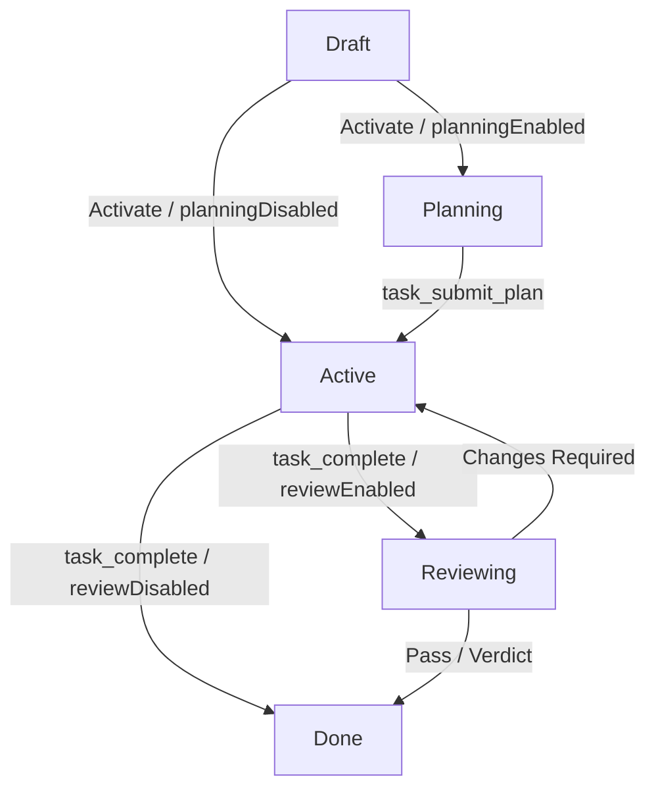

# Architecture: Planning Phase & Role-Based Agent Assignment

This document provides a detailed overview of the design, state machine, and sandbox restrictions introduced in caretaker-cli to support role-based agent assignments and the structured planning phase.

## 1. Multi-Agent Roles

Instead of assigning a single agent to run a task from start to finish, caretaker-cli supports three distinct runtime roles:

1. **Developer Agent (`task.agentId` / `project.agentId`)**:
   - The primary agent responsible for executing task implementation.
   - Has full access to modifying tools (such as write/edit/multiedit file and bash commands).
2. **Planner Agent (`plannerAgentId` / `project.plannerAgentId`)**:
   - The agent responsible for the initial **Planning Phase** (when the task status is `'planning'`).
   - Runs in a read-only sandboxed environment.
   - Fallbacks: `task.plannerAgentId` $\to$ `project.plannerAgentId` $\to$ Developer Agent.
3. **Reviewer Agent (`reviewerAgentId` / `project.reviewerAgentId`)**:
   - The agent responsible for validating and reviewing worktrees at the completion stage (when status is `'reviewing'`).
   - Fallbacks: `task.reviewerAgentId` $\to$ `project.reviewerAgentId` $\to$ Developer Agent.

## 2. The Task Lifecycle & States

The addition of the `'planning'` and `'reviewing'` statuses extends the task state machine as follows:

- **Planning Phase**:
  - Activated automatically upon task wake-up if `planningEnabled` is true at the task or project level.
  - The Planner Agent evaluates the workspace and submits an implementation plan via the built-in `mcp__task__task_submit_plan` tool.
  - While in `'planning'`, standard mutating tools (`write`, `edit`, `multiedit`, `bash`) are stripped from the agent's environment. Only read tools (`read_file`, `glob`, `grep`, etc.) are permitted.
  - Transitioning out of `'planning'` occurs when the agent successfully runs `mcp__task__task_submit_plan`.
- **Review Phase**:
  - Triggered at the completion stage if `reviewEnabled` is true.
  - If `reviewEnabled` is disabled, the worktree is finalized and cleaned up immediately upon calling `task_complete`.

## 3. Configuration & Overrides

Gate settings and role override settings are tri-state values that inherit from the project level when not specified on individual tasks:

| Setting Name | Task Field | Project Field | Default Value | Description |
| :--- | :--- | :--- | :--- | :--- |
| **Planning Phase** | `task.planningEnabled` | `project.planningEnabled` | **Disabled (`false`)** | Enables planning phase |
| **Review Gate** | `task.reviewEnabled` | `project.reviewEnabled` | **Enabled (`true`)** | Requires code review |
| **Planner Agent** | `task.plannerAgentId` | `project.plannerAgentId` | *Developer Agent* | Custom planner agent ID |
| **Reviewer Agent** | `task.reviewerAgentId` | `project.reviewerAgentId` | *Developer Agent* | Custom reviewer agent ID |
